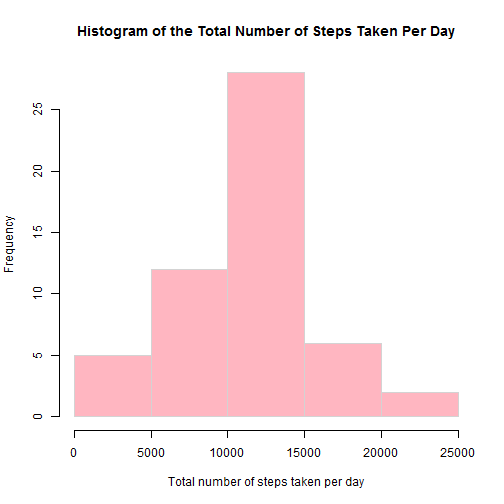
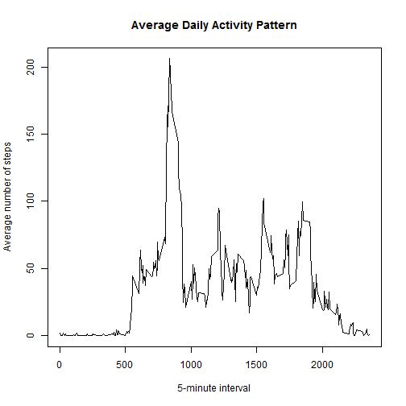
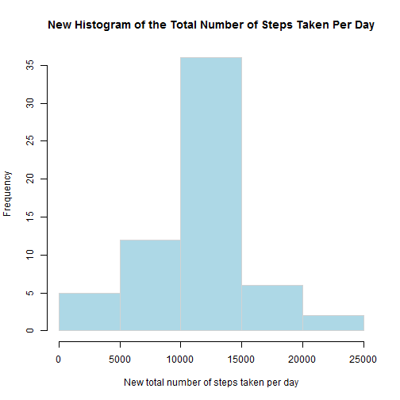
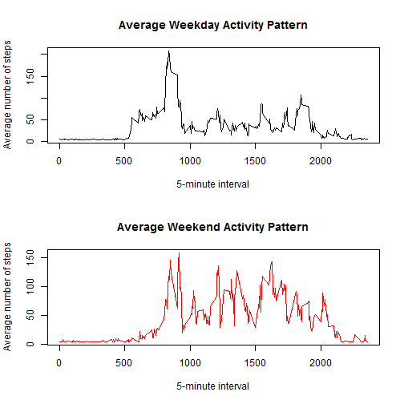

#Assignment

##Loading and preprocessing the data

###1. Load the data
###2. Process/transform the data(if necessary) into a forat suitable for your analysis


```r
setwd("C:/temp")
activity <- read.csv("C:/temp/activity.csv", header=TRUE)
head(activity)
```

```
##   steps       date interval
## 1    NA 2012-10-01        0
## 2    NA 2012-10-01        5
## 3    NA 2012-10-01       10
## 4    NA 2012-10-01       15
## 5    NA 2012-10-01       20
## 6    NA 2012-10-01       25
```

##What is mean total number of steps taken per day?

###1. Calculate the total number of steps taken per day


```r
t.steps.per.day <- aggregate(activity$steps, by=list(DATE=activity$date), FUN=sum)
head(t.steps.per.day)
```

```
##         DATE     x
## 1 2012-10-01    NA
## 2 2012-10-02   126
## 3 2012-10-03 11352
## 4 2012-10-04 12116
## 5 2012-10-05 13294
## 6 2012-10-06 15420
```

###2. If you do not understand the difference between a histogram and a barplot, research the difference between them. Make a histogram of the total number of steps taken each day


```r
hist(t.steps.per.day[,2], col="lightpink", border="lightgrey",
     main="Histogram of the Total Number of Steps Taken Per Day", 
     xlab="Total number of steps taken per day", ylab="Frequency")
```

 

###3. Calculate and report the mean and median of the total number of steps taken per day


```r
summary(t.steps.per.day[,2])
```

```
##    Min. 1st Qu.  Median    Mean 3rd Qu.    Max.    NA's 
##      41    8841   10760   10770   13290   21190       8
```

##What is the average daily activity pattern?

###1. Make a time series plot of the 5-minute interval (x-axis) and the average number of steps taken, averaged across all days (y-axis)


```r
average.steps <- aggregate(activity$steps, by=list(INTERVAL=activity$interval), 
			   FUN=mean, na.rm=TRUE)
head(average.steps)
```

```
##   INTERVAL         x
## 1        0 1.7169811
## 2        5 0.3396226
## 3       10 0.1320755
## 4       15 0.1509434
## 5       20 0.0754717
## 6       25 2.0943396
```

```r
plot(average.steps, type="l", main="Average Daily Activity Pattern",
     xlab="5-minute interval", ylab="Average number of steps")
```

 

###2. Which 5-minute interval, on average across all the days in the dataset, contains the maximum number of steps?


```r
subset(average.steps, grepl(max(average.steps[,2]), average.steps$x))
```

```
##     INTERVAL        x
## 104      835 206.1698
```

##Imputing missing values
###1. Calculate and report the total number of missing values in the dataset


```r
length(activity$steps[activity$steps=="NA"]) 
```

```
## [1] 2304
```

###2. Devise a strategy for filling in all of the missing values in the dataset


```r
activity$steps[is.na(activity$steps)] <- mean(average.steps[,2], na.rm=TRUE)        
```

###3. Create a new dataset that is equal to the original dataset but with the missing data filled in


```r
impute.activity <- activity
head(impute.activity)
```

```
##     steps       date interval
## 1 37.3826 2012-10-01        0
## 2 37.3826 2012-10-01        5
## 3 37.3826 2012-10-01       10
## 4 37.3826 2012-10-01       15
## 5 37.3826 2012-10-01       20
## 6 37.3826 2012-10-01       25
```

###4. Make a histogram of the total number of steps taken each day and Calculate and report the mean and median total number of steps taken per day


```r
impute.t.steps.per.day <- aggregate(impute.activity$steps, 
                                            by=list(DATE=impute.activity$date), FUN=sum)
head(impute.t.steps.per.day) 
```

```
##         DATE        x
## 1 2012-10-01 10766.19
## 2 2012-10-02   126.00
## 3 2012-10-03 11352.00
## 4 2012-10-04 12116.00
## 5 2012-10-05 13294.00
## 6 2012-10-06 15420.00
```

```r
hist(impute.t.steps.per.day[,2], col="lightblue", border="lightgrey",
     main="New Histogram of the Total Number of Steps Taken Per Day", 
     xlab="New total number of steps taken per day", ylab="Frequency")
```

 

```r
summary(impute.t.steps.per.day[,2])
```

```
##    Min. 1st Qu.  Median    Mean 3rd Qu.    Max. 
##      41    9819   10770   10770   12810   21190
```

##Are there differences in activity patterns between weekdays and weekends?

###1. Create a new factor variable in the dataset with two levels-"weekday" and "weekend" indicating whether a given date is a weekday or weekwnd day


```r
Sys.setlocale("LC_TIME", "English")
```

```
## [1] "English_United States.1252"
```

```r
impute.activity$date <- as.POSIXlt(impute.activity$date, format="%Y-%m-%d")
impute.activity$day <- weekdays(impute.activity$date) 

day.impute.activity <- impute.activity
head(day.impute.activity)
```

```
##     steps       date interval    day
## 1 37.3826 2012-10-01        0 Monday
## 2 37.3826 2012-10-01        5 Monday
## 3 37.3826 2012-10-01       10 Monday
## 4 37.3826 2012-10-01       15 Monday
## 5 37.3826 2012-10-01       20 Monday
## 6 37.3826 2012-10-01       25 Monday
```

```r
day.impute.activity$day <- gsub("(Monday)|(Tuesday)|(Wednesday)|(Thursday)|(Friday)", 
				"weekday", impute.activity$day)
day.impute.activity$day <- gsub("(Saturday)|(Sunday)", "weekend", day.impute.activity$day) 

week.impute.activity <- day.impute.activity
head(week.impute.activity)
```

```
##     steps       date interval     day
## 1 37.3826 2012-10-01        0 weekday
## 2 37.3826 2012-10-01        5 weekday
## 3 37.3826 2012-10-01       10 weekday
## 4 37.3826 2012-10-01       15 weekday
## 5 37.3826 2012-10-01       20 weekday
## 6 37.3826 2012-10-01       25 weekday
```

```r
weekday.impute.activity <- subset(week.impute.activity, week.impute.activity$day==c("weekday"))
head(weekday.impute.activity)
```

```
##     steps       date interval     day
## 1 37.3826 2012-10-01        0 weekday
## 2 37.3826 2012-10-01        5 weekday
## 3 37.3826 2012-10-01       10 weekday
## 4 37.3826 2012-10-01       15 weekday
## 5 37.3826 2012-10-01       20 weekday
## 6 37.3826 2012-10-01       25 weekday
```

```r
weekend.impute.activity <- subset(week.impute.activity, week.impute.activity$day==c("weekend"))
head(weekend.impute.activity)
```

```
##      steps       date interval     day
## 1441     0 2012-10-06        0 weekend
## 1442     0 2012-10-06        5 weekend
## 1443     0 2012-10-06       10 weekend
## 1444     0 2012-10-06       15 weekend
## 1445     0 2012-10-06       20 weekend
## 1446     0 2012-10-06       25 weekend
```

```r
weekday.average.steps <- aggregate(weekday.impute.activity$steps, 
				   by=list(INTERVAL=weekday.impute.activity$interval), FUN=mean)
head(weekday.average.steps)
```

```
##   INTERVAL        x
## 1        0 7.006569
## 2        5 5.384347
## 3       10 5.139902
## 4       15 5.162124
## 5       20 5.073235
## 6       25 6.295458
```

```r
weekend.average.steps <- aggregate(weekend.impute.activity$steps, 
				   by=list(INTERVAL=weekend.impute.activity$interval), FUN=mean)
head(weekend.average.steps)
```

```
##   INTERVAL        x
## 1        0 4.672825
## 2        5 4.672825
## 3       10 4.672825
## 4       15 4.672825
## 5       20 4.672825
## 6       25 7.922825
```

###2. Make a panel plot containing a time series plot of the 5-minute interval (x-axis) and the average number of steps taken, averaged across all weekday days or weekend days (y-axis)
   

```r
par(mfrow = c(2, 1))
       
plot(weekday.average.steps, type="l", col="black", main="Average Weekday Activity Pattern",
     xlab="5-minute interval", ylab="Average number of steps")
plot(weekend.average.steps, type="l", col="red", main="Average Weekend Activity Pattern",
     xlab="5-minute interval", ylab="Average number of steps")  
```

 
